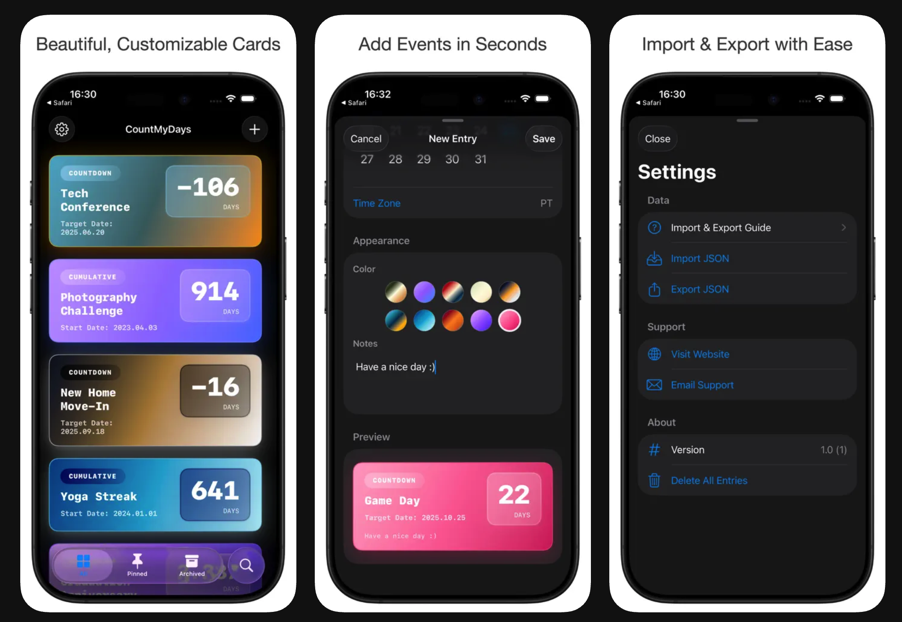

# CountMyDays

Repository: <https://github.com/everettjf/countdays>

CountMyDays is a SwiftUI iOS app for tracking countdowns and cumulative day counts. Create entries for important dates, track progress over time, and keep everything tidy with pinning, archiving, and export/import.




## Features
- Countdown and cumulative (count up) trackers.
- Repeat rules for countdown targets (weekly, monthly, yearly).
- Optional date ranges with out-of-range behavior handling.
- Time zone aware day counting.
- Pin and archive entries for better organization.
- Automatic iCloud sync with local offline storage.
- JSON import/export for backups or migration.
- Local notifications for countdown target days.
- Home Screen and Lock Screen widgets for pinned and upcoming entries.
- Flexible reminders on the day, 1/3/7/30 days before, or a custom number of days.
- Quick-start templates for birthdays, anniversaries, trips, exams, and habit tracking.
- High-resolution card image sharing through the system share sheet.

## Requirements
- Xcode with iOS Simulator support.

## Build
```sh
xcodebuild -project CountMyDays.xcodeproj -scheme CountMyDays -sdk iphonesimulator build
```

## Run
Open `CountMyDays.xcodeproj` in Xcode and select a simulator/device.

## Import/Export
- Exported files are JSON with ISO-8601 dates.
- Import accepts the same JSON schema and validates required fields.

## Data Storage and Migration
- Entries are stored locally for offline access and automatically synchronized through the user's iCloud account.
- Existing local-only data is uploaded to iCloud the first time this version launches.
- Sync uses last-modified timestamps and deletion records so edits and deletions merge safely across devices.

## Project Structure
- `CountMyDays/`: main Swift/SwiftUI source.
- `CountMyDays/Views/`: UI screens and reusable view components.
- `CountMyDays/Models/`: data models (`Entry`, `EntryType`, etc.).
- `CountMyDays/Services/`: app services (day counting, import/export, notifications).
- `CountMyDays/Store/`: persistence and data store logic.
- `CountMyDays/Utilities/`: helpers, formatters, extensions.
- `CountMyDays/Assets.xcassets/` and `CountMyDays/Resources/`: assets and bundled data.
- `CountMyDays.xcodeproj/`: Xcode project metadata.

## Contributing
- Follow the guidelines in `AGENTS.md`.
- Keep changes focused and consistent with existing code style.
- Include screenshots or screen recordings for UI changes.

## Star History
[](https://star-history.com/#everettjf/countdays&Date)
